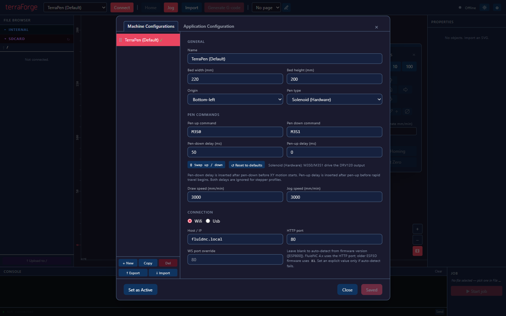

# Connect via USB-C

The terraPen can be driven over USB-C instead of Wi-Fi, using
[terraForge](terraForge.md).

## Steps

1. Plug the terraPen into a wall outlet as normal.
2. Connect a USB-C cable between the terraPen and your computer.
3. In terraForge, open **machine settings** and set **Connection** to **Usb** rather
   than Wifi.
4. Connect.

That is all that is required. Jogging, homing, pen control, file upload and plotting
all work over the cable.

!!! tip "Useful when Wi-Fi is awkward"
    A cabled connection sidesteps network problems entirely, which is worth having in
    a busy studio or a space with poor Wi-Fi.

## Other software

Lightburn can also drive the terraPen — see
[Lightburn profiles and settings](LightburnProfilesAndSettings.md) — but terraForge is
the supported route and the one to use unless you have a specific reason not to.
