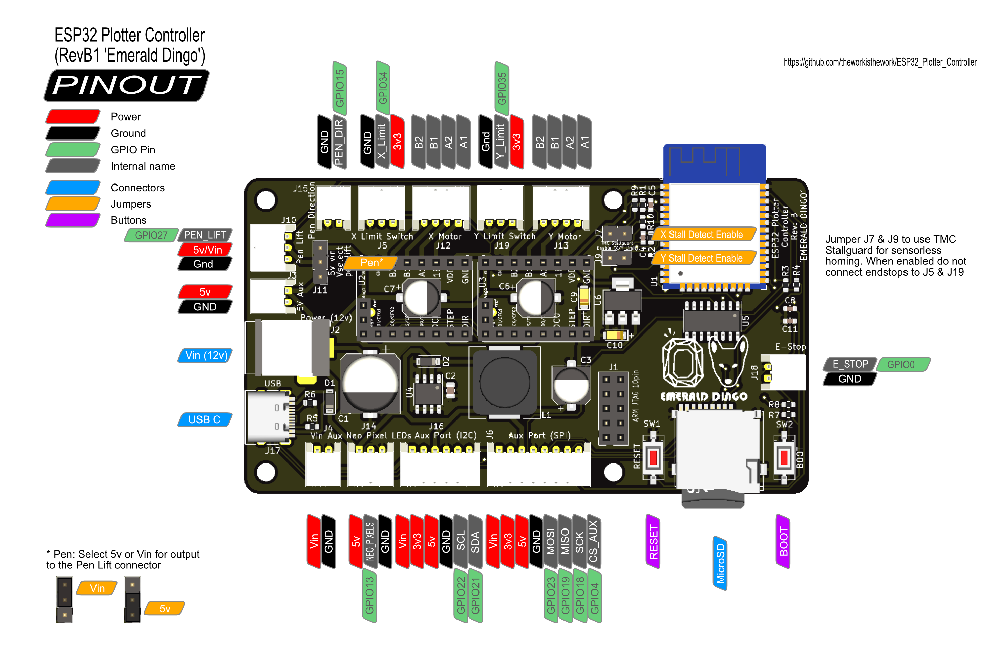

# Hardware and source files

The terraPen is open source. The mechanical design, the controller board and the
firmware configuration are all published, so you can repair, modify or rebuild the
machine yourself.

## Mechanical

| Repository | What's in it |
|---|---|
| [terraPen-mechanical-design-files](https://github.com/theworkisthework/terraPen-mechanical-design-files) | 3D files and bill of materials for the A2 coreXY plotter |

## Electronics

| Repository | What's in it |
|---|---|
| [ESP32_Plotter_Controller](https://github.com/theworkisthework/ESP32_Plotter_Controller) | The controller board — an ESP32 and TMC2130 two-axis design |
| [z-axis-addon](https://github.com/theworkisthework/z-axis-addon) | Z-axis TMC2130 stepper driver add-on |
| [fet_solenoid_driver](https://github.com/theworkisthework/fet_solenoid_driver) | Solenoid driver, for [earlier machines](solenoid.md) |
| [12v_servo_driver_module](https://github.com/theworkisthework/12v_servo_driver_module) | Servo driver module |

### Controller pinout

Useful when tracing a cable — the limit switches are **J5 for X** and **J19 for Y**.

## Software

| Repository | What's in it |
|---|---|
| [terraForge](https://github.com/theworkisthework/terraForge) | The desktop app — see [terraForge](terraForge.md) |
| [fluidnc-config-files](https://github.com/theworkisthework/fluidnc-config-files) | Machine configurations — see [YAML configuration settings](YAMLConfigurationSettings.md) |
| [Lightburn-Profiles](https://github.com/theworkisthework/Lightburn-Profiles) | Profiles for [Lightburn](LightburnProfilesAndSettings.md) |
| [FluidNC](https://github.com/theworkisthework/FluidNC) | The motion control firmware the terraPen runs |

Everything else is at
[github.com/theworkisthework](https://github.com/theworkisthework).
