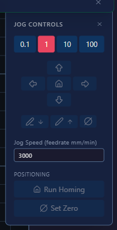

# Moving the pen carriage

## There is nothing to stop you

!!! warning "The terraPen has no travel limits"
    There are no soft limits and no hard limits set. The limit switches are used for
    **homing only** — they do not stop the carriage during ordinary moves.

    If you keep jogging past the end of the travel, the machine will drive into its
    own frame and keep pushing. Nothing intervenes.

Use the large steps to cross the bed, and switch to small steps as you approach the
edges. If you are not sure where the carriage is, home it first.

## In terraForge

The **jog panel** in [terraForge](terraForge.md) is the normal way to move the
machine.

It holds everything you need in one place:

- **Step size** — 0.1, 1, 10 or 100 mm per click
- **Direction arrows** for X and Y, with the house icon returning to origin
- **Pen up** and **pen down** — the pencil icons
- **Jog speed** in mm/min
- **Run Homing** — runs the homing cycle
- **Set Zero** — sets the current position as your job origin

## By hand

**Only with the machine powered off.** Push the carriage gently, and never force it
against the ends of its travel.

## In the web UI

The jog wheel in the **Controls** panel moves the carriage. Click a segment to move in
that direction; the distance depends on which ring you click:

| Ring | Distance per click |
|---|---|
| Outer | 100 mm |
| Second | 10 mm |
| Third | 1 mm |
| Inner | 0.1 mm |

Start with a large step to get close, then work inwards for fine positioning.

## The Z axis

The stepper toolhead has roughly **14 mm** of Z travel. In normal use you only need
about 5 mm of it — see
[setting the pen height](1stPlot.md#3-fit-the-pen-and-set-its-height).

On an earlier machine with a [solenoid pen lift](solenoid.md), the pen is driven up
and down by the solenoid rather than a stepper.

!!! warning "Mind the bed"
    Z zero is wherever you last set it, normally with the nib on the paper. Jogging
    down from there drives the nib into the bed. Use pen up and pen down rather than
    jogging Z once your height is set.
