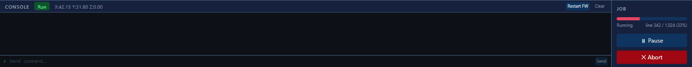

# Starting, pausing and stopping a plot

Plots are run from [terraForge](terraForge.md).

## Starting

1. Select your file in the **file browser**, or upload it to the machine.
2. Press **Start job**.

Progress appears in the job panel, counting through the G-code line by line:

## Stopping a plot: pause first

!!! warning "Always pause before you abort"
    **Pause** is the graceful stop. The machine finishes what it is doing, lifts the
    pen, and waits — you can resume and carry on, and nothing else is disturbed.

    **Abort** is not graceful. It drops the machine into an **alarm** state, because
    the firmware stops trusting where the pen is. Clearing that is sometimes just a
    reset, but it can mean powering the machine down and homing again before you can
    do anything at all. It is a faff, and it is avoidable.

So the order to reach for is:

1. **Pause** — stops the machine safely, and you can resume.
2. **Resume** — if you only needed to look at something, change a pen, or reseat the
   paper.
3. **Abort** — only once you have decided the plot is definitely finished with.

Pausing first also means that if you change your mind, you have not lost the job.

## After an abort

The machine will be in alarm. To recover:

1. Clear the alarm — the alarm control in terraForge, or `$X` in the console.
2. **Run Homing** to re-establish position.
3. Set your zero again if the job needed one.

!!! note "If clearing the alarm is not enough"
    Occasionally an abort leaves the machine unwilling to move even after the alarm is
    cleared. Switch it off at the rear right, bring it back up, and home it. See
    [Restarting the terraPen](restartTerraPen.md).

## In the web UI

The [web UI](terraPenWebUI.md) can also start and stop plots, using
**Pause** and **Cancel** in the job progress panel. The same rule applies — pause
before you cancel.
