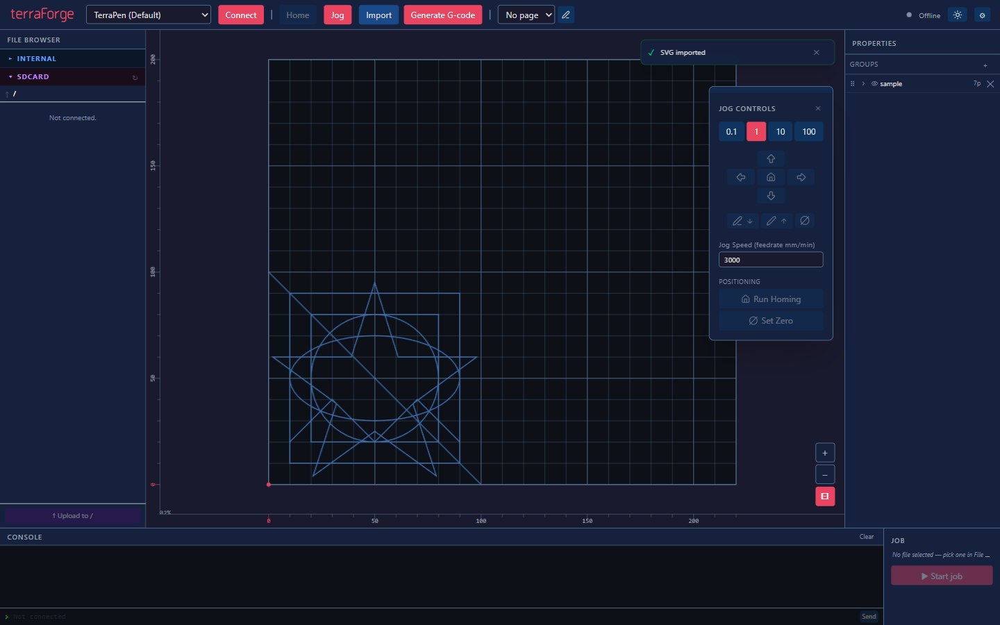
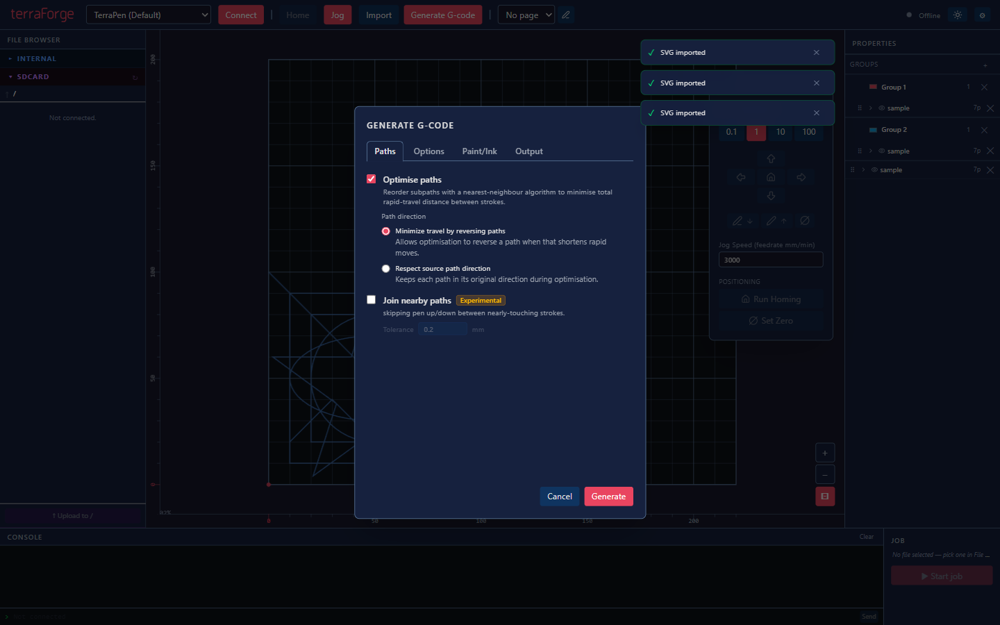

# terraForge

**terraForge is how we recommend you drive the terraPen.** It is our own desktop
application, built for this machine, and it replaces the older routine of exporting,
converting and uploading G-code by hand.

- [Download the latest release](https://github.com/theworkisthework/terraForge/releases)
- [Full terraForge user guide](https://github.com/theworkisthework/terraForge/blob/main/docs/terraForge-user-guide.md)

!!! note "Take the latest release candidate"
    terraForge is under active development, so the newest build is normally an **RC**
    release. That is the one to install.

Artwork sits on a representation of the bed, with the file browser on the left, jog
controls to hand, and the job panel bottom right.

## 1. Set up your machine profile

Open the settings and create or edit a machine configuration.

The settings that matter for a terraPen:

| Setting | Value |
|---|---|
| **Bed width / height** | `594` × `420` mm for the A2 terraPen |
| **Origin** | Bottom-left |
| **Pen type** | Match your toolhead — **stepper** on current machines. [Solenoid machines](solenoid.md) need pen commands and delays set too. |
| **Connection** | **Wifi** or **Usb** |
| **Host / IP** | `terrapen.local`, or the address your router assigned |

!!! warning "Check the bed size before your first plot"
    The supplied default profile is smaller than an A2 terraPen. Set the bed to
    594 × 420 mm, or artwork will not position where you expect.

## 2. Connect

Press **Connect** in the toolbar. The status indicator at the top right shows the
connection state and the machine's position.

## 3. Import your artwork

**Import** accepts SVG and PDF, and will open existing G-code for preview. Position
and scale it on the bed.

## 4. Generate G-code

**Optimise paths** reorders the drawing with a nearest-neighbour algorithm to cut down
the distance the pen travels between strokes. Leave it on unless you have a reason to
preserve the original order.

## 5. Upload and plot

Send the file to the machine's SD card and start the job. Progress, **Pause** and
**Abort** appear in the job panel:

## Feedback

terraForge is developed in the open, and questions, suggestions and bug reports are
genuinely wanted. Bring them to [our Discord](https://discord.gg/fEXrmUm5nR).

!!! note "You still set the machine up by hand"
    terraForge handles artwork and jobs. Fitting paper and setting pen height still
    happen at the machine — see [Your first plot](1stPlot.md).

---

*Screenshots from the [terraForge](https://github.com/theworkisthework/terraForge)
repository, MIT licensed.*
